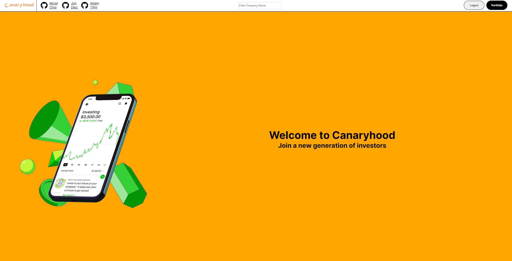
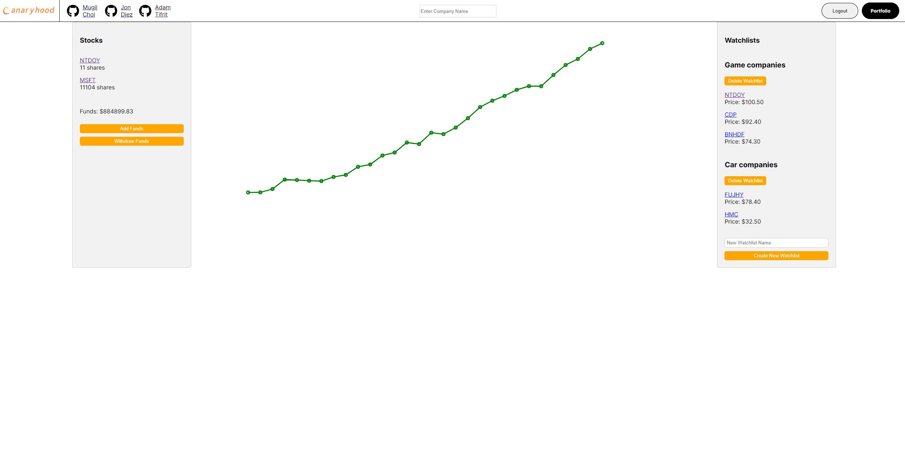
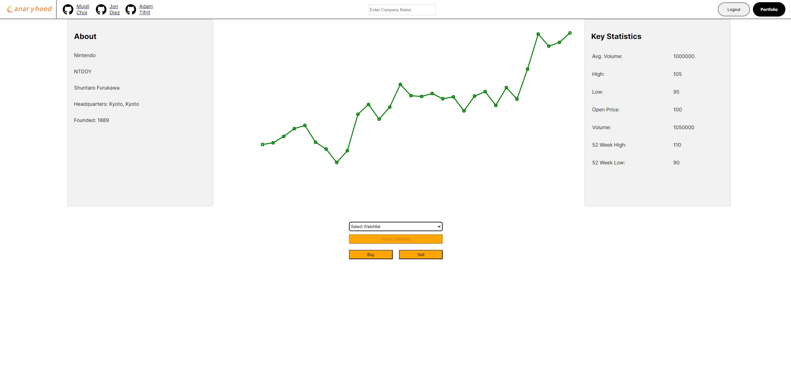
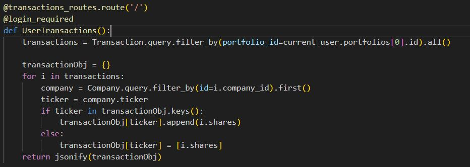

# Canaryhood

Canaryhood Website: https://canaryhood.onrender.com/

# Description:

   Canaryhood is a full-stack web application inspired by Robinhood. It is designed to be a simulation of a stock trading platform that allows users to manage investments, track a portfolio, and keep tabs on stocks of interest.

# Features:

   User Authentication:

      Canaryhood protects the security of accounts registered with it by encrypting and securing passwords to offer security to users signing up. A demo user is also available to allow exploration of the site. Users must be logged in to access features such as portfolio, search, and stock purchasing.

   Portfolio:

      Canaryhood allows users to have a portfolio containing the shares of stocks they have purchased on the application.The portfolio also houses the watchlist information.

      - User can add stocks to their portfolio by buying shares of them.
      - User can remove stocks from their portfolio by selling their shares.
      - User can view a graph of the performance of their portfolio.
      - User can add funds to their balance
      - User can withdraw funds from their balance.

   Watchlist:

      Canaryhood allows users to create and delete watchlists on which they can add stocks of interest from their stock details pages. Links to these stocks will then be populated into a watchlist sidebar on the portfolio page.

      - User can add stocks to their watchlist
      - User can remove stocks from their watchlist
      - User can create new wacthlists
      - User can delete watchlists
      - User can view watchlists on their portfolio page

   Buy/Sell:

      Canaryhood allows users to seemlessly purchase and sell their shares of stocks from the company details page of the stock they would like to buy or sell. This automatically updates the user's balance and portfolio.

      - User can buy shares of a stock on a company detail page
      - User can sell shares of a stock on a company detail page
      - Portfolio balance and shares will be updated for them

   Search:

      Canaryhood allows logged in users to search for stocks of interest and select from a dropdown menu to be redirected to that stock's details page.
      This allows users to access price, key statistics, and historical information about any company on the platform.

      - Users can dynamically search for stocks
      - Users can click on result to be redirected to company details page


# Technlogies:

- Frontend:
   - Redux
   - React
   - Javascript
   - CSS
   - HTML

- Backend:
   - Flask
   - Python


# Screenshots:
   - Landing Page:
      
   - Portfolio:
      
   - Company Details:
      

# Technical Implementation:

   Canaryhood never deletes past transactions which is an important feature of applications that deal with finances. As a result, displaying information that is determined by transaction history is implemented by querying for the user's transactions once per page and utilizing the data across calculations needed to display useful information to the user while hiding less useful information. The screenshot below shows how the transactions are returned as a dictionary which uses stock tickers as keys and arrays of previous transaction share buy/sell information.
   

# Installation Instructions:

   - install dependencies:
      ```bash
         pipenv install -r requirements.txt
      ```

   - Create a .env file using the provided .envexample file.
   - Run the following commands in the terminal to setup the database and run the backend server:
      ```bash
         pipenv run flask db upgrade
      ```
      ```bash
         pipenv run flask seed all
      ```
      ```bash
         pipenv run flask run
      ```
   - In another terminal enter the react-app directory and run the following command to run the frontend:
      ```bash
         npm start
      ```

# Future Plans:

   - We plan to update the site with functionality such as buying and selling stocks from the portfolio page.
   - We plan to improve sitewide style with coordinated design.

# Contributors:
   Adam Tifrit
   https://github.com/atifrit

   Jon Diez
   https://github.com/jondiezv

   Mugil Choi
   https://github.com/moogchoi
